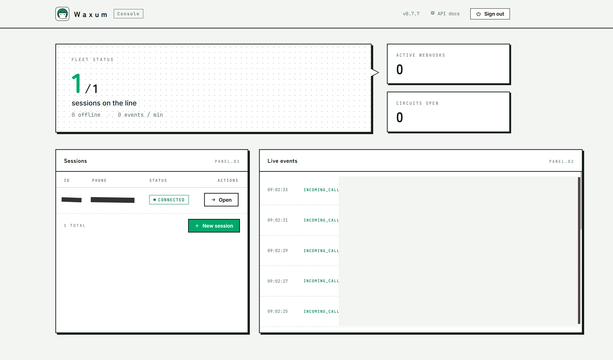
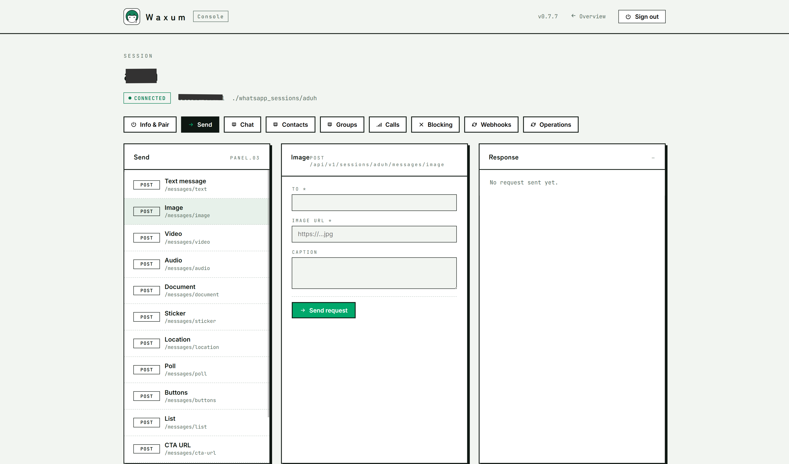

<p align="center">
  
</p>

<h1 align="center">Waxum</h1>

<p align="center">
  WhatsApp REST API gateway. Written in Rust.
</p>

<p align="center">
  <a href="https://waxum.imtaqin.id">Docs</a> ·
  <a href="https://waxum.imtaqin.id/docs/api/sessions">API</a> ·
  <a href="https://github.com/imtaqin/waxum/releases">Releases</a>
</p>

---

Native single-binary. Multi-session. Multi-DB. Webhooks + HMAC. JWT + Bearer. Swagger. Prometheus. NATS JetStream (optional).

Production-grade. **130+ REST endpoints across 22 feature modules.**

## Features

### Messaging

| Feature | Endpoint prefix |
|---|---|
| Text, image, video, audio, document, sticker | `POST /sessions/{sid}/messages/*` |
| Location, contact card, poll | `POST /sessions/{sid}/messages/{location,contact,poll}` |
| Reactions, forward, edit, revoke, star | `POST /sessions/{sid}/messages/{react,forward,edit,delete,star}` |
| Reply / quote with context | `POST /sessions/{sid}/messages/text` (`quoted_id`) |
| Fake-reply (spoofed quote metadata) | `POST /sessions/{sid}/fake-reply/*` |
| CTA URL with image + header/footer | `POST /sessions/{sid}/messages/cta-url` |
| Broadcast lists | `POST /sessions/{sid}/broadcast` |
| Chat state (typing / recording / paused) | `POST /sessions/{sid}/chat-state` |
| Read receipts, mark as read | `POST /sessions/{sid}/messages/read` |
| MEX GraphQL passthrough (server queries) | `POST /sessions/{sid}/mex` |
| Message history + full-text search (SQLite FTS5) | `GET /sessions/{sid}/messages/search?q=`, `GET /messages/search?q=` |

### Scheduling & bulk send

| Feature | Endpoint |
|---|---|
| Scheduled send (`send_at` on all 34 send endpoints) | `GET/DELETE /sessions/{sid}/scheduled`, `GET /scheduled` |
| Blast queue (bulk send, pacing, dedup, retry, DLQ) | `POST /sessions/{sid}/blast`, `GET /sessions/{sid}/blasts*`, `GET /blasts` |

### Voice & video calls

| Feature | Endpoint |
|---|---|
| Ring / hangup / accept / reject | `POST /sessions/{sid}/calls/*` |
| Text-to-speech call (Edge TTS, 300+ voices) | `POST /sessions/{sid}/calls/tts` |
| Audio playback call (MP3/WAV upload or URL) | `POST /sessions/{sid}/calls/play` |
| Native MLOW codec (WA proprietary, pure Rust) | internal |
| Peer audio recording (WAV) | `GET /sessions/{sid}/calls/{cid}/recording.wav` |
| Bidirectional media WebSocket stream (audio) | `WS /sessions/{sid}/calls/media/ws?to=&kind=audio` |
| Bidirectional media WebSocket stream (audio + video, H.264) | `WS /sessions/{sid}/calls/media/ws?to=&kind=av` — transport only, bring your own H.264 encoder/decoder (e.g. ffmpeg) on the client side |
| Local transcript of a recording (whisper.cpp) | `POST /sessions/{sid}/calls/{cid}/transcript` — needs `WHISPER_MODEL_PATH` |

### Session management

| Feature | Endpoint |
|---|---|
| Multi-session on one process | `POST /sessions` |
| Pair via QR (PNG + SVG) | `GET /sessions/{sid}/qr`, `/qr-svg` |
| Pair via 8-char code | `POST /sessions/{sid}/pair` |
| Auto-reconnect on start | env `WA_AUTO_RECONNECT_ON_START=1` |
| Fleet stats (uptime, per-status counts) | `GET /stats` |
| Search sessions (name/phone/JID) | `GET /sessions/search?q=` |
| Bulk purge (by status, older-than, dry-run) | `POST /sessions/purge` |
| Bulk disconnect / reconnect | `POST /sessions/{disconnect,reconnect}-all` |
| Re-enable all tripped webhook circuits | `POST /webhooks/reenable-all` |

### Groups

| Feature | Endpoint prefix |
|---|---|
| Create / leave / info / settings | `POST /sessions/{sid}/groups/*` |
| Member add / remove / promote / demote | `POST /sessions/{sid}/groups/{gid}/*` |
| Invite link create / revoke / join | `POST /sessions/{sid}/groups/{gid}/{invite,revoke,join}` |
| Description / subject / picture / announce / lock | `PATCH /sessions/{sid}/groups/{gid}/*` |
| Pending join requests approval | `POST /sessions/{sid}/groups/{gid}/requests` |

### Contacts / privacy / presence

| Feature | Endpoint |
|---|---|
| `is_on_whatsapp` batch check | `POST /sessions/{sid}/contacts/check` |
| Contact info + profile picture | `GET /sessions/{sid}/contacts/{jid}` |
| Sync device contacts | `POST /sessions/{sid}/contacts/sync` |
| Block / unblock / list blocked | `POST /sessions/{sid}/blocking/*` |
| Privacy settings (last-seen, profile, status) | `PATCH /sessions/{sid}/privacy` |
| Presence broadcast (online / offline) | `POST /sessions/{sid}/presence` |

### Media & storage

| Feature | Endpoint |
|---|---|
| Multipart upload (image/video/audio/document) | `POST /sessions/{sid}/media/upload` |
| Direct URL send (server downloads on your behalf) | `POST /sessions/{sid}/messages/image?url=` |
| Download inbound media by message id | `GET /sessions/{sid}/media/{mid}` |
| Media storage on disk (configurable path) | env `WA_MEDIA_DIR` |

### Webhooks

| Feature | Endpoint |
|---|---|
| Per-session webhook URL + secret | `POST /sessions/{sid}/webhooks` |
| HMAC-SHA256 signature (`X-Webhook-Signature`) | header |
| Event filter mask (message, receipt, call, presence, …) | `event_mask` field |
| Circuit breaker (auto-trip on Nx 5xx) | env `WEBHOOK_CB_THRESHOLD` |
| Dead-letter queue + replay | `GET /webhooks/dlq`, `POST /webhooks/dlq/replay` |
| Re-enable all tripped circuits (bulk) | `POST /webhooks/reenable-all` |

### Ops / observability

| Feature | Endpoint |
|---|---|
| Server-rendered ops console (Handlebars, no SPA) | `/` |
| Per-session playground covering 60+ endpoints | `/s/{sid}` |
| Swagger UI + OpenAPI 3.1 schema | `/swagger-ui` |
| Liveness / readiness probes | `/livez`, `/readyz` |
| Prometheus metrics (counters + gauges) | `/metrics` |
| Session tags (in-memory + JSON snapshot) | `GET/PUT/POST /api/v1/sessions/{sid}/tags`, `DELETE .../tags/{tag}`, `GET /api/v1/tags`, `GET /api/v1/sessions?tag=` |
| SSE event tail (filter by session / event) | `GET /api/v1/events/tail` |
| List Edge-TTS voices | `GET /api/v1/voices` |
| TTS voice preview (returns MP3) | `GET /api/v1/tts/preview?text=&voice=` |
| Instance-lock file (single-writer safety) | on-boot |
| FD-limit warning at start (nofile < 65536) | on-boot |
| JWT + static Bearer auth, per-token IP allowlist (planned) | header |
| NATS JetStream event fan-out (optional) | env `NATS_URL` |

### Storage backends

| Feature | Notes |
|---|---|
| SQLite (default, single-binary friendly) | `WA_DB=sqlite:///path.db` |
| Postgres (recommended for prod, > 50 sessions) | `WA_DB=postgres://…` |
| MySQL | `WA_DB=mysql://…` |

## Roadmap / on-going

| Feature | Status |
|---|---|
| ~~Video call (H.264 relay over `calls/media/ws?kind=av`)~~ | shipped 0.9.0 |
| Group voice call | **blocked upstream** — `whatsapp-rust` has no multi-party relay/SFU client at all (single-peer engine only); not a waxum gap, needs its own library-level project |
| ~~Local STT on recording (whisper.cpp)~~ | shipped 0.9.0 — needs `WHISPER_MODEL_PATH` set to a GGML model file, not zero-setup like the rest of waxum |
| ~~Message search via SQLite FTS~~ | shipped 0.8.0 |
| ~~Blast queue engine (bulk send, dedup, retry, DLQ)~~ | shipped 0.8.0 |
| ~~Scheduled send (`send_at` ISO)~~ | shipped 0.8.0 |
| S3 backend for media & recordings | scoped |
| ~~Session tags / groups~~ | shipped 0.7.13 |
| Rust client crate | scoped |
| n8n community node | scoped |
| Chatwoot bridge | idea |
| Distributed mode (multi-instance + leader elect) | idea |
| Session migration between instances | idea |
| Signal-store encryption at rest (sqlcipher) | idea |

## Console

Server-rendered ops dashboard baked into the binary. Point a browser at
`http://<host>:3451/`, sign in with your `SUPERADMIN_TOKEN`, and you land
on the fleet overview. Click any session for the per-session playground
covering 60+ REST endpoints — send messages, drive calls, manage groups,
inspect webhooks, all without leaving the tab.

<p align="center">
  
</p>

<p align="center">
  
</p>

## Install

```bash
# Linux / macOS
curl -fsSL https://raw.githubusercontent.com/imtaqin/waxum/main/scripts/install.sh | sudo bash

# Windows (elevated PowerShell)
irm https://raw.githubusercontent.com/imtaqin/waxum/main/scripts/install.ps1 | iex

# Docker
docker pull fdciabdul/waxum
```

Or build from source:

```bash
git clone https://github.com/imtaqin/waxum && cd waxum
cargo build --release
./target/release/waxum
```

## Endpoints

| URL | Purpose |
|---|---|
| `/` | Console — fleet overview + per-session playground |
| `/api/v1` | REST API |
| `/swagger-ui` | OpenAPI schema + interactive docs |
| `/livez` · `/readyz` | Liveness · readiness probes |
| `/metrics` | Prometheus text exposition |

## Stack

Rust nightly · Axum 0.8 · Tokio · [whatsapp-rust](https://github.com/oxidezap/whatsapp-rust) · Postgres/MySQL/SQLite · NATS JetStream · Prometheus · Utoipa.

## Docs

Everything else — endpoints, webhooks, health probes, deployment,
`.env` reference — lives in the docs:

**[waxum.imtaqin.id](https://waxum.imtaqin.id)**

## License

MIT
